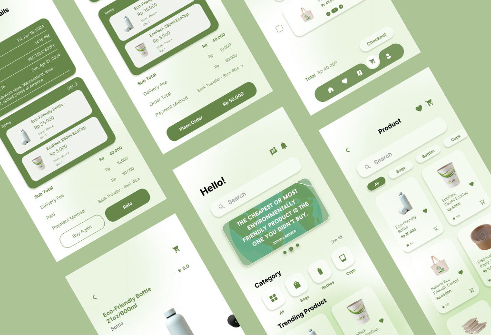

# Ecofy |  Eco-Friendly Product Marketplace UI/UX Design

Ecofy is a UI/UX design project developed as part of the User Interface Experience course. This project focuses on designing a digital platform for buying and selling eco-friendly products, with the aim of encouraging users to make more sustainable purchasing decisions. The interface is designed to be clean, intuitive, and visually appealing to enhance usability and overall user experience. The design process emphasizes user-centered principles, including clear navigation, structured information layout, and ease of interaction. Users are able to explore products, view detailed information, and complete transactions efficiently. This project demonstrates the ability to translate concepts into user-friendly design solutions that support both functionality and user needs.

## 📸 Design Preview

## 👤 Role
- UI/UX Designer

## 🛠️ Tech Stack & Tools

## 🚀 How to View Project
You can view the interactive UI prototype directly on Figma via the [Figma Prototype Link](https://www.figma.com/proto/fhzYTRhv7JFQKdhzPMEnf4/Ecofy-Prototype?node-id=1-3&p=f&t=8JTjopFZhHKvs8Fl-8&scaling=scale-down&content-scaling=responsive&page-id=0%3A1&starting-point-node-id=1%3A3&hide-ui=1) (Optimized for desktop and mobile responsive view).
